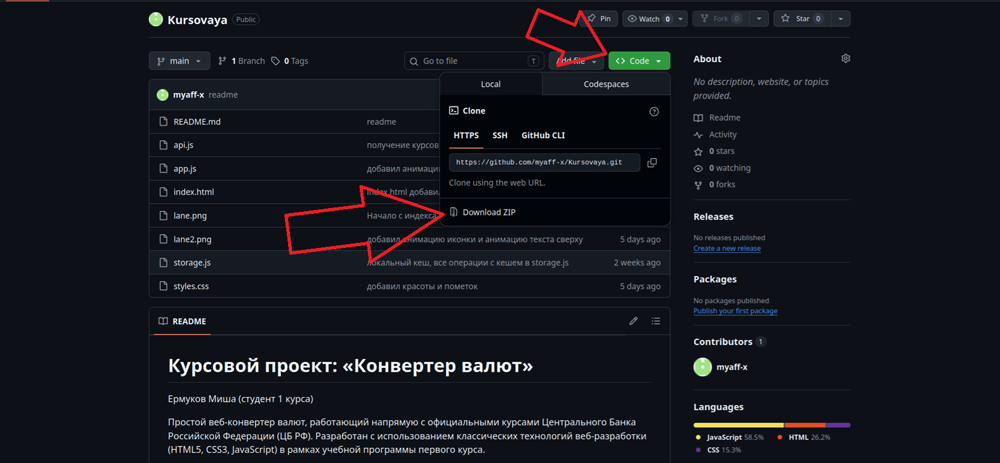
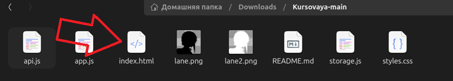

# Курсовой проект: «Конвертер валют»
Ермуков Миша (студент 1 курса)

Простой веб-конвертер валют, работающий напрямую с официальными курсами Центрального Банка Российской Федерации (ЦБ РФ). Разработан с использованием классических технологий веб-разработки (HTML5, CSS3, JavaScript) в рамках учебной программы первого курса.

## 1. Структура проекта

Проект разделен на 3 логических скрипта для чистоты структуры, но при этом запускается напрямую из браузера без локального сервера (через обычные теги `<script>` в строго определенном порядке):

```
currency-converter/
├── index.html        # Разметка интерфейса, форма, сетка курсов и история
├── styles.css        # Стили (адаптивный дизайн)
├── storage.js        # Хранение в localStorage (кэш курсов, история, настройки)
├── api.js            # Сетевые запросы к API ЦБ РФ (включая исторические архивные курсы)
└── app.js            # Основной обработчик: события, валидация и вывод данных
```

## 2. Алгоритм работы и используемое API

Для работы с курсами используется API ЦБ РФ:
* **Курсы на сегодня:** `https://www.cbr-xml-daily.ru/daily_json.js`
* **Архивные курсы:** `https://www.cbr-xml-daily.ru/archive/{year}/{month}/{day}/daily_json.js`

### Основные механизмы:
1. **Кэширование на 1 час:** Курсы сохраняются в `localStorage` с временной меткой. В течение 1 часа приложение берет данные из кэша.
2. **Оффлайн-режим:** Если при загрузке курсов нет сети, приложение автоматически восстановит курсы из кэша и покажет предупреждение «Оффлайн режим».
3. **Обработка выходных дней:** ЦБ РФ не публикует курсы на выходных (архив возвращает 404). В этом случае приложение вежливо сообщает пользователю, что курсов на выбранный день нет (выходной), и предлагает выбрать будний день.

## 3. Математика расчетов

ЦБ РФ публикует курсы валют по отношению к Российскому Рублю (RUB) за определенный Номинал (количество единиц).
Расчет перевода из валюты **A** в валюту **B** выполняется по формуле:

```
Курс_А = Стоимость_А / Номинал_А
Курс_В = Стоимость_В / Номинал_В
Результат = Сумма * (Курс_А / Курс_В)
```
*Для рубля (RUB) виртуально установлены параметры `Value = 1.0` и `Nominal = 1`, поэтому формула универсальна.*

## 4. Инструкция по установке и запуску
1. **Для установки** надо нажать на зеленую кнопку code -> download ZIP

2. **Для запуска**, распаковать в любую папку все файлы и оттуда запустить index.html
